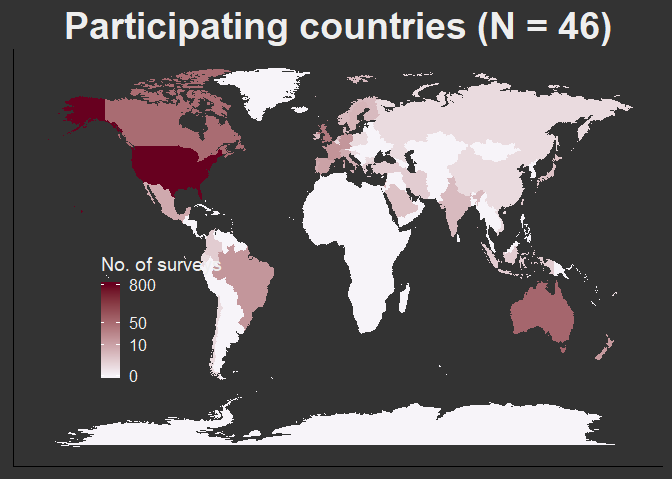
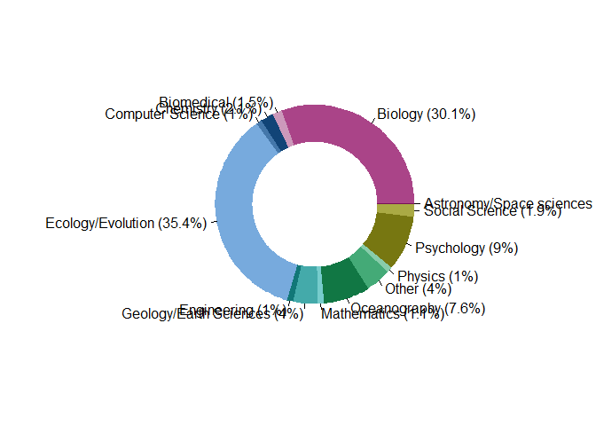
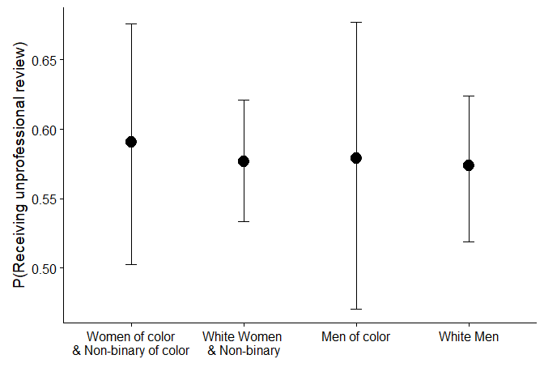
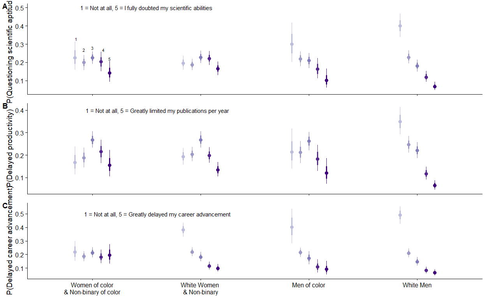
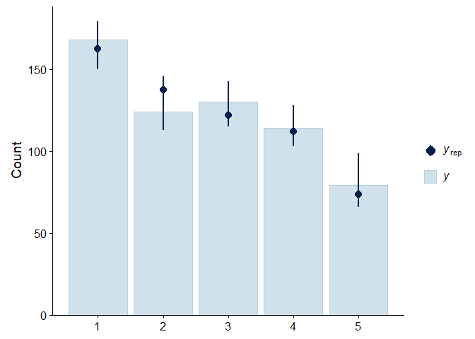
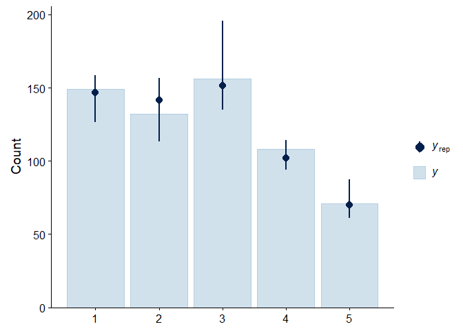
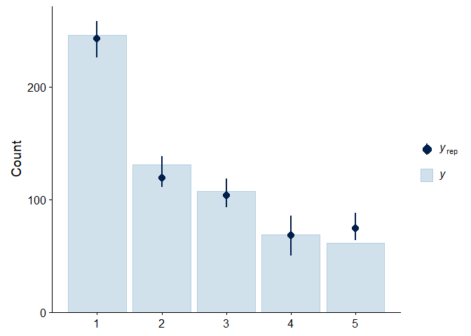

Unprofessional Reviews
================
Dr. Nyssa Silbiger and Dr. Amber Stubler
September 16, 2019

-   [Metadata.](#metadata.)
-   [Demographic Info.](#demographic-info.)
-   [How many Countries participated?](#how-many-countries-participated)
-   [Broad areas of expertise](#broad-areas-of-expertise)
-   [Have you ever received an unpro review?](#have-you-ever-received-an-unpro-review)
-   [Logisitic regression on probability of recieving an unpro review](#logisitic-regression-on-probability-of-recieving-an-unpro-review)
-   [Table of all raw data by all genders](#table-of-all-raw-data-by-all-genders)
-   [Table with sample size for each group](#table-with-sample-size-for-each-group)
-   [BRMS for Scientific aptitude](#brms-for-scientific-aptitude)
-   [BRMS analysis for Scientific Productivity](#brms-analysis-for-scientific-productivity)
-   [BRMS analysis for Career Advancement](#brms-analysis-for-career-advancement)
-   [Posterior predictive checks of each model](#posterior-predictive-checks-of-each-model)
-   [What percent of people received more than one review](#what-percent-of-people-received-more-than-one-review)

This is an IRB approved project lead by Drs. Amber Stubler and Nyssa Silbiger on the effects of unprofessional peer reviews in STEM fields.

``` r
# read in libraries
library(tidyverse)
library(DT)
library(reshape2)
library(scales)
library(waffle)
library(ggthemes)
library(MASS)
library(cowplot)
library(grid)
library(gridExtra)
library(brms)
library(tidybayes)
library(modelr)
library(forcats)
library(magrittr)
library(ggstance)
library(multcomp)
library(bayesplot)
library(broom)
library(knitr)
library(car)
library(cowplot)
library(maptools)
library(maps)
library(RColorBrewer)
library(gridGraphics)
```

First, we will read in the data and make a data dictionary of all the questions from the Qualtrics survey

``` r
#read in the data
data<-read.csv('Data/Unprofessional peer reviews_May 10, 2019_14.13.csv')
# read in the metadata
metadata<-read.csv('Data/Metadata.csv')
```

Metadata.
=========

``` r
metadata<-t(metadata[,12:45])
metadata<-data.frame(cbind(rownames(metadata),as.character(metadata[,1])))
```

Demographic Info.
=================

``` r
# Gender
# rename female and male as women and men
levels(data$Q1)[c(2,4)]<-c('Women','Men')

gender<- data %>%
  group_by(Q1) %>%
  tally()%>% # count up the number of each group
  slice(2:n()) %>% # remove first row
  droplevels()
  
# make a waffle plots
gen<-gender$n
#calculate perccent
p<-round((gender$n/sum(gender$n))*100,1)
names(gen)<-paste0(gender$Q1,'\n(',p,'%)') # rename labels with the percent

#Racial and ethnicity
Race<- data %>%
  group_by(Q9) %>%
  tally()%>% # count up the number of each group
  slice(2:n()) %>% # remove first row
  droplevels()

# group mixed race together
mix<-str_detect(Race$Q9, ",") # detect names with a comma
mix.sum<-sum(Race$n[mix]) # sum those together
Mixed<-cbind.data.frame("Mixed Race", mix.sum) #create a mixed race categoty
colnames(Mixed)<-names(Race)
Race<-Race[which(!mix),] # pull out the remainder
Race<-rbind(Race, Mixed)
Race$Q9<-droplevels(Race$Q9)

#make vector
race<-Race$n
#calculate perccent
p<-round((Race$n/sum(Race$n))*100,1)
names(race)<-paste0(Race$Q9,'\n(',p,'%)') # rename labels with the percent

# make waffle plot
pdf('Output/demograph.pdf', width = 12, height = 6)
demoplot<-iron(waffle::waffle(gen, 
               rows = 15,
               title = 'Gender',legend_pos = 'bottom', size = 1), 

waffle::waffle(race, 
               rows = 15,
               colors = c("#CC0000", "#006600", "#669999", "#00CCCC", 
                             "#660099", "#CC0066", "#FF9999", "#FF9900", 
                             "black"),
               title = 'Race and Ethnic Categories',legend_pos = 'bottom', size = 1)
)
dev.off()
```

    ## png 
    ##   2

``` r
# Degree Stage
Degree<- data %>%
  group_by(Q2) %>%
  tally()%>% # count up the number of each group
  droplevels()

#make vector
deg<-Degree$n
#calculate perccent
p<-round((Degree$n/sum(Degree$n))*100,1)
names(deg)<-paste0(Degree$Q2,'\n(',p,'%)') # rename labels with the percent

#Career stage
Career<- data %>%
  group_by(Q3) %>%
  tally()%>% # count up the number of each group
  droplevels()

#make vector
career<-Career$n
#calculate perccent
p<-round((Career$n/sum(Career$n))*100,1)
names(career)<-paste0(Career$Q3,'\n(',p,'%)') # rename labels with the percent
```

How many Countries participated?
================================

``` r
countries<-unique(data$Q8) 
countries<-droplevels(countries[2:length(countries)])# remove the blank

#make a map to visualize it
# get number of participants by country
countries<-data %>%
  group_by(Q8) %>%
  tally()%>% # count up the number of each group
  #slice(2:n()) %>% # remove first row
  droplevels()

# the blank is USA
countries$Q8[1]<-"United States of America"
#find the other USA
US<-which(countries=='United States of America')
countries[1,2]<-sum(countries$n[US]) # add them together
#remove the second USA instance
countries<-countries[-US[2],]

thismap <- map_data("world") # get the map pf the world

# find the countries in the survey and match them to the countrie names in the map
myCountries <- thismap$region %in% countries$Q8

#recode the countrie names
countries$Q8 <- recode_factor(countries$Q8, 'United States of America' = 'USA',
                                               'United Kingdom of Great Britain and Northern Ireland' = 'UK',
                                               'Viet Nam' = 'Vietnam',
                                               'Russian Federation' = 'Russia',
                                               'Hong Kong (S.A.R.)' = 'China',
                                               'Trinidad and Tobago' = 'Trinidad',
                                               'Iran, Islamic Republic of...' = 'Iran')

#countries$selected<-1
  
map_countries<-left_join(thismap, countries, by =c('region' = 'Q8'))
```

    ## Warning: Column `region`/`Q8` joining character vector and factor, coercing
    ## into character vector

``` r
# make na  = 0
map_countries$n[is.na(map_countries$n)]<-0

mapplot<-ggplot(map_countries, aes( x = long, y = lat, group = group )) +
  geom_polygon(aes(fill = n+1))+
  scale_fill_gradient(name = "No. of surveys", trans = "log", low = "#F7F4F9", high =  "#67001F",
                      breaks =  c(1, 10, 50, 800), labels = c(0, 10, 50,  800))+
#  theme(legend.position = "none") +
  ggtitle('Participating countries (N = 46)')+
  theme(text = element_text(color = '#EEEEEE')
        ,plot.title = element_text(size = 28)
        ,plot.subtitle = element_text(size = 14)
        ,axis.ticks = element_blank()
        ,axis.text = element_blank()
        ,panel.grid = element_blank()
        ,panel.background = element_rect(fill = '#333333')
        ,plot.background = element_rect(fill = '#333333')
        ,legend.position = c(.12,.36)
        ,legend.background = element_blank()
        ,legend.key = element_blank()
        ,axis.title.x=element_blank()
        ,axis.title.y=element_blank()
  )+
    ggsave('Output/map.pdf', device = 'pdf',width = 11, height = 8)  
mapplot
```



Broad areas of expertise
========================

``` r
# People could pick multiples so need to split by comma then calculate percentage for each group
expert<-separate(data, Q7,into = c("a","b","c","d", "e"),sep = ",")%>% # separate by comma and make new column
  dplyr::select(a,b,c,d,e)  # only select the temporary columns
```

    ## Warning: Expected 5 pieces. Additional pieces discarded in 3 rows [195,
    ## 697, 718].

    ## Warning: Expected 5 pieces. Missing pieces filled with `NA` in 1096
    ## rows [1, 2, 3, 4, 5, 6, 7, 8, 9, 10, 11, 12, 13, 14, 15, 16, 17, 18, 19,
    ## 20, ...].

``` r
expert<-rbind(expert$a,expert$b, expert$c, expert$d, expert$e) # combine everything into one column
expert<-as.data.frame(expert[-which(is.na(expert))])  # remove all the NAs
colnames(expert)<-'group'

# make a pichart
expert<-expert %>%
  group_by(group) %>%
  tally()  # count up the number of each group
  p<-round((expert$n/sum(expert$n))*100,1) # calculate percentages
  expert$group<-paste0(expert$group,' (',p,'%)') # rename labels with the percent
# make a color palette with a lot of colors
tol21rainbow= c("#771155", "#AA4488", "#CC99BB", "#114477", "#4477AA", "#77AADD", "#117777", "#44AAAA", "#77CCCC", "#117744", "#44AA77", "#88CCAA", "#777711", "#AAAA44", "#DDDD77", "#774411", "#AA7744", "#DDAA77", "#771122", "#AA4455", "#DD7788")


source('Scripts/doughnut.R') # source the code to make a donut plot
dev.new()
doughnut(x = expert$n, labels = expert$group, col = tol21rainbow, outer.radius = .8, inner.radius = .5)
```

    ## Warning in rep(lty, length.out = nx): 'x' is NULL so the result will be
    ## NULL

    ## Warning in rep(density, length.out = nx): 'x' is NULL so the result will be
    ## NULL

``` r
expert.plot<-recordPlot()
dev.off()
```

    ## png 
    ##   2

``` r
# show plot here
doughnut(x = expert$n, labels = expert$group, col = tol21rainbow, outer.radius = .8, inner.radius = .5)
```

    ## Warning in rep(lty, length.out = nx): 'x' is NULL so the result will be
    ## NULL

    ## Warning in rep(lty, length.out = nx): 'x' is NULL so the result will be
    ## NULL



Have you ever received an unpro review?
=======================================

``` r
#Unpro reviews
Unpro<- data %>%
  group_by(Q34) %>%
  tally()%>% # count up the number of each group
  #slice(2:n()) %>% # remove first row
  droplevels()

perUnpro<-100*(Unpro$n[Unpro$Q34=='Yes']/sum(Unpro$n))
print(paste(round(perUnpro,1), '% received unprofessional review'))
```

    ## [1] "58 % received unprofessional review"

Logisitic regression on probability of recieving an unpro review
================================================================

``` r
# remove  all data where "I prefer not to say"
remove<-grepl("I prefer not to say", as.matrix(data)) # find the text in the DF
dim(remove) <- dim(as.matrix(data)) # make it a matrix
rem<-which(remove, arr.ind = T) # find all the rows and columns

# only need to remove the ones from columns 12 and 19 (race and gender). The rest of the data can still be used in this analysis
r2<-which(rem[,2]==12 |rem[,2]==19)
r<-as.data.frame(rem[r2,])[,1]
QCData<-data[-r,]
QCData<-droplevels(QCData)  
```

Table of all raw data by all genders
====================================

``` r
# Aptitude
QCData %>%
  group_by(Q1,Q26) %>%
  tally() %>%
  drop_na()
```

    ## # A tibble: 17 x 3
    ## # Groups:   Q1 [4]
    ##    Q1           Q26     n
    ##    <fct>      <dbl> <int>
    ##  1 ""           1       1
    ##  2 Women        1      72
    ##  3 Women        2      63
    ##  4 Women        2.5     1
    ##  5 Women        3      95
    ##  6 Women        3.5     1
    ##  7 Women        4      80
    ##  8 Women        5      55
    ##  9 Men          1      97
    ## 10 Men          2      59
    ## 11 Men          3      34
    ## 12 Men          4      33
    ## 13 Men          5      24
    ## 14 Non-binary   1       1
    ## 15 Non-binary   2       1
    ## 16 Non-binary   3       1
    ## 17 Non-binary   4       1

``` r
# productivity
QCData %>%
  group_by(Q1,Q27) %>%
  tally() %>%
  drop_na()
```

    ## # A tibble: 13 x 3
    ## # Groups:   Q1 [4]
    ##    Q1           Q27     n
    ##    <fct>      <int> <int>
    ##  1 ""             2     1
    ##  2 Women          1    63
    ##  3 Women          2    79
    ##  4 Women          3   110
    ##  5 Women          4    70
    ##  6 Women          5    45
    ##  7 Men            1    89
    ##  8 Men            2    54
    ##  9 Men            3    46
    ## 10 Men            4    35
    ## 11 Men            5    25
    ## 12 Non-binary     4     3
    ## 13 Non-binary     5     1

``` r
# career
QCData %>%
  group_by(Q1,Q28) %>%
  tally() %>%
  drop_na() %>%
  filter(Q1!="") # remove the blank
```

    ## # A tibble: 13 x 3
    ## # Groups:   Q1 [4]
    ##    Q1           Q28     n
    ##    <fct>      <int> <int>
    ##  1 Women          1   124
    ##  2 Women          2    91
    ##  3 Women          3    63
    ##  4 Women          4    47
    ##  5 Women          5    41
    ##  6 Men            1   124
    ##  7 Men            2    40
    ##  8 Men            3    43
    ##  9 Men            4    22
    ## 10 Men            5    19
    ## 11 Non-binary     1     2
    ## 12 Non-binary     3     1
    ## 13 Non-binary     5     1

``` r
# first need to clean the dataframe a bit
# 
QCData$Q1[which(QCData$Q1=="Non-binary")]<-'Women'
empty<-which(QCData$Q1 == "") # remove the empty column for gender  
QCData<-QCData[-empty,]
QCData<-droplevels(QCData)
#rename women as women and non-binary
levels(QCData$Q1)[1]<-"Women \n& Non-binary"

# also need to remove the empty columns for race since this is one of the main questions
empty<-which(QCData$Q9 == "") # remove the empty column for race 
QCData<-QCData[-empty,]
QCData<-droplevels(QCData)

# but there are lots of "" in other parts of the dataset
empty<-which(QCData == "", arr.ind = TRUE)
QCData[empty]<-NA
QCData<-droplevels(QCData)

# Race
# group as white or not
QCData$race<-ifelse(QCData$Q9=="White","White","Non-White")

# do interssectional with white women versus URM women
QCData$intersect<-paste(QCData$race, QCData$Q1)
QCData$intersect <- factor(QCData$intersect, levels = c("Non-White Women \n& Non-binary", "White Women \n& Non-binary","Non-White Men","White Men"))
# order the intersect data so that it goes non-white Women, white Women, nw Men, wMen

# reoder the gender aand race factors
QCData$race<-as.factor(QCData$race)

# make the "not sure" NA
QCData$Q10[QCData$Q10 =='Not sure']<-NA

# add binary response for a logisitc regression
QCData$BadReview<-ifelse(QCData$Q34=='Yes',1,0)

# #brms doesnt like how I named the factors so rename them here and put correct labels in the plot
levels(QCData$intersect)<-c("Non-White Women", "White Women", "Non-White Men","White Men")

m1 <- brm(
  BadReview ~intersect,
  data = QCData,
  family = "bernoulli",
  seed = 123, cores = 2
  # Adding a seed makes results reproducible.
)
```

    ## Compiling the C++ model

    ## Start sampling

``` r
log.data<-QCData %>%
     data_grid(intersect)%>%
     add_fitted_draws(m1, dpar = TRUE) %>%
     median_qi()

pd <- position_dodge(width = 0.4)

# logisitics plot
ggplot(data = log.data, aes(group(race)))+
     geom_point(aes(x = intersect, y = .value, cex = 2), position = pd)+
     geom_errorbar(aes(ymin=.value.lower, ymax=.value.upper, x = intersect), width=.1, position = pd)+
  ylab('P(Receiving unprofessional review)')+
  xlab("")+
  scale_x_discrete(
        labels=c("Women of color\n& Non-binary of color","White Women \n& Non-binary", "Men of color","White Men"))+
  scale_color_discrete(name = "")+
  scale_size(guide = 'none')+
  ggsave('Output/Logisticplot.pdf', width = 7, height = 4, device = 'pdf')
```



Table with sample size for each group
=====================================

``` r
# Clean the data frame to just include those that recieved an unpro review
UnproReviews<-QCData %>%
  filter(Q34 =='Yes')%>%
  dplyr::select(Q1,Q2, Q3, Q4,Q6, Q7,Q9, Q10, Q11, Q26, Q27, Q28, Q23, Q39, race, intersect, Q22) %>%
  droplevels()


  samplesize<-UnproReviews %>% 
  dplyr::select(Q1, intersect, race)%>% # select the columns
  rename(Gender = "Q1")%>%
  tidyr::gather("id", "value", 1:3) %>% # gather everything into long format
  mutate(value, Group = paste(id,value))%>% # make a new columns that pastes the names and ids
  mutate_if(sapply(., is.character), as.factor) %>% # make everything a factor
  na.omit() %>% # remove the NAs
  group_by(Group)%>% # group by the full values
  tally() # count them
```

    ## Warning: attributes are not identical across measure variables;
    ## they will be dropped

``` r
kable(samplesize, caption = "Sample size for groups that recieved unprofessional reviews")
```

| Group                     |    n|
|:--------------------------|----:|
| Gender Men                |  248|
| Gender Women              |     |
| & Non-binary 370          |     |
| intersect Non-White Men   |   52|
| intersect Non-White Women |   68|
| intersect White Men       |  196|
| intersect White Women     |  302|
| race Non-White            |  120|
| race White                |  498|

BRMS for Scientific aptitude
============================

``` r
# run a bayseian oridnal logisitic model cumulative distribution 
# one person put a decimal instead of an integer so round the values
UnproReviews$Q26<-as.integer(round(UnproReviews$Q26))

#brms model doesn like how I named the factors, so rename them simple and rename them again in the plot
levels(UnproReviews$intersect)<-c("Non-White Women", "White Women", "Non-White Men","White Men")

# model changes in scientific aptitude
fita <- brm(Q26 ~ intersect, 
            data = UnproReviews, family = cumulative(), silent = TRUE, refresh = 0)
```

    ## Warning: Rows containing NAs were excluded from the model.

    ## Compiling the C++ model

    ## Start sampling

``` r
# different plots to visualize ordinal logisitic regression
aptplot<-UnproReviews %>%
  data_grid(intersect)%>%
  add_fitted_draws(fita, dpar = TRUE) %>%
  ggplot(aes(x = intersect, y = .value, col = .category))+
  scale_x_discrete(
        labels=c("Women \n& Non-binary of color","White Women \n& Non-binary", "Men of color","White Men"))+
  stat_pointinterval(position = position_dodge(width = 0.4))+
  scale_size_continuous(guide = FALSE)+
  #ggtitle("P(Questioning scientific aptitude | gender*race)") +
  ylab("P(Questioning scientific aptitude)")+
  scale_discrete_manual(aesthetics = "color",values = c( "#BCBDDC", "#9E9AC8", "#807DBA", "#54278F", "#3F007D"))+
  annotate("text", label=c(1:5), x=c(0.85,0.92,1,1.1,1.16), y=c(0.33,0.27,0.28,0.27,0.22), size=3)+
  annotate("text",label = "1 = Not at all, 5 = I fully doubted my scientific abilities", x = 1.5, y = 0.5, size = 4)+
  theme(legend.position = "none", axis.title.x=element_blank(),
        axis.text.x=element_blank())
```

BRMS analysis for Scientific Productivity
=========================================

``` r
# model changes in productivity
fitp <- brm(Q27 ~ intersect, 
            data = UnproReviews, family = cumulative(), silent = TRUE, refresh = 0)
```

    ## Warning: Rows containing NAs were excluded from the model.

    ## Compiling the C++ model

    ## recompiling to avoid crashing R session

    ## Start sampling

``` r
# different plots to visualize ordinal logisitic regression
prodplot<-UnproReviews %>%
  data_grid(intersect)%>%
  add_fitted_draws(fitp, dpar = TRUE) %>%
  ggplot(aes(x = intersect, y = .value, col = .category))+
  scale_x_discrete(
        labels=c("Women \n& Non-binary of color","White Women \n& Non-binary", "Men of color","White Men"))+
  stat_pointinterval(position = position_dodge(width = 0.4))+
  scale_size_continuous(guide = FALSE)+
   scale_discrete_manual(aesthetics = "color",values = c( "#BCBDDC", "#9E9AC8", "#807DBA", "#54278F", "#3F007D"))+
   annotate("text",label = "1 = Not at all, 5 = Greatly limited my publications per year", x = 1.6, y = 0.4, size = 4)+
  ylab("P(Delayed productivity)")+
  theme(legend.position = "none", axis.title.x=element_blank(),
        axis.text.x=element_blank())
```

BRMS analysis for Career Advancement
====================================

``` r
# model career delayed?
fitc <- brm(Q28 ~ intersect, 
            data = UnproReviews, family = cumulative(), silent = TRUE, refresh = 0)
```

    ## Warning: Rows containing NAs were excluded from the model.

    ## Compiling the C++ model

    ## recompiling to avoid crashing R session

    ## Start sampling

``` r
# different plots to visualize ordinal logisitic regression
careerplot<-UnproReviews %>%
  data_grid(intersect)%>%
  add_fitted_draws(fitc, dpar = TRUE) %>%
  ggplot(aes(x = intersect, y = .value, col = .category))+
  scale_x_discrete(
        labels=c("Women of color\n& Non-binary of color","White Women \n& Non-binary", "Men of color","White Men"))+
  stat_pointinterval(position = position_dodge(width = 0.4))+
  scale_size_continuous(guide = FALSE)+
  scale_discrete_manual(aesthetics = "color",values = c( "#BCBDDC", "#9E9AC8", "#807DBA", "#54278F", "#3F007D"))+
    annotate("text",label = "1 = Not at all, 5 = Greatly delayed my career advancement", x = 1.6, y = 0.5, size = 4)+
   #ggtitle("P(Delayed career advancement | gender*race)") +
  ylab("P(Delayed career advancement)")+
  theme(legend.position = "none", axis.title.x = element_blank())
```

``` r
# Results plot
resultsplot<-plot_grid(aptplot, prodplot, careerplot, align = "v", labels = "AUTO", nrow = 3)
ggsave(filename = "Output/resultsplot.pdf", plot = resultsplot, width = 8, height = 13)
resultsplot
```



Posterior predictive checks of each model
=========================================

really good agreement with observed (y) versus predicted data (yrep)

``` r
pp_check(fita, type = "bars") # aptitude
```

    ## Using 10 posterior samples for ppc type 'bars' by default.



``` r
pp_check(fitp, type = "bars") # productivity
```

    ## Using 10 posterior samples for ppc type 'bars' by default.



``` r
pp_check(fitc, type = "bars") # career delay
```

    ## Using 10 posterior samples for ppc type 'bars' by default.



``` r
# Create a large table with all the probablilities
# Aptitude
aptdata<-UnproReviews %>%
  data_grid(intersect)%>%
  add_fitted_draws(fita, dpar = TRUE) %>%
  summarise(med = median(.value))%>%
  dplyr::select(intersect, .category, med) %>%
  spread(.,.category, med)
```

    ## Adding missing grouping variables: `.row`

``` r
kable(aptdata, label = 'Aptitude median probabilities', digits = 2, format = 'markdown')
```

|  .row| intersect       |     1|     2|     3|     4|     5|
|-----:|:----------------|-----:|-----:|-----:|-----:|-----:|
|     1| Non-White Women |  0.23|  0.20|  0.22|  0.20|  0.14|
|     2| White Women     |  0.20|  0.19|  0.23|  0.22|  0.17|
|     3| Non-White Men   |  0.30|  0.22|  0.21|  0.16|  0.10|
|     4| White Men       |  0.40|  0.23|  0.18|  0.12|  0.07|

``` r
aptdata.lower<-UnproReviews %>%
  data_grid(intersect)%>%
  add_fitted_draws(fita, dpar = TRUE) %>%
  summarise(lower=quantile(.value, probs=0.025))%>%
  dplyr::select(intersect, .category, lower) %>%
  spread(.,.category, lower)
```

    ## Adding missing grouping variables: `.row`

``` r
kable(aptdata.lower, label = 'Aptitude lower probabilities', digits = 2, format = 'markdown')
```

|  .row| intersect       |     1|     2|     3|     4|     5|
|-----:|:----------------|-----:|-----:|-----:|-----:|-----:|
|     1| Non-White Women |  0.16|  0.16|  0.19|  0.15|  0.09|
|     2| White Women     |  0.16|  0.16|  0.19|  0.18|  0.13|
|     3| Non-White Men   |  0.20|  0.18|  0.17|  0.11|  0.06|
|     4| White Men       |  0.34|  0.19|  0.15|  0.09|  0.05|

``` r
aptdata.upper<-UnproReviews %>%
  data_grid(intersect)%>%
  add_fitted_draws(fita, dpar = TRUE) %>%
  summarise(upper=quantile(.value, probs=0.975))%>%
  dplyr::select(intersect, .category, upper) %>%
  spread(.,.category, upper)
```

    ## Adding missing grouping variables: `.row`

``` r
kable(aptdata.upper, label = 'Aptitude upper probabilities', digits = 2, format = 'markdown')
```

|  .row| intersect       |     1|     2|     3|     4|     5|
|-----:|:----------------|-----:|-----:|-----:|-----:|-----:|
|     1| Non-White Women |  0.31|  0.24|  0.26|  0.26|  0.21|
|     2| White Women     |  0.24|  0.22|  0.26|  0.26|  0.20|
|     3| Non-White Men   |  0.42|  0.26|  0.25|  0.22|  0.17|
|     4| White Men       |  0.47|  0.27|  0.21|  0.15|  0.09|

``` r
#productivity
proddata<-UnproReviews %>%
  data_grid(intersect)%>%
  add_fitted_draws(fitp, dpar = TRUE) %>%
  summarise(med = median(.value))%>%
  dplyr::select(intersect, .category, med) %>%
  spread(.,.category, med)
```

    ## Adding missing grouping variables: `.row`

``` r
kable(proddata, label = 'Productivity median probabilities', digits = 2, format = 'markdown')
```

|  .row| intersect       |     1|     2|     3|     4|     5|
|-----:|:----------------|-----:|-----:|-----:|-----:|-----:|
|     1| Non-White Women |  0.17|  0.19|  0.27|  0.22|  0.16|
|     2| White Women     |  0.19|  0.20|  0.27|  0.20|  0.13|
|     3| Non-White Men   |  0.21|  0.21|  0.26|  0.18|  0.12|
|     4| White Men       |  0.35|  0.25|  0.22|  0.12|  0.06|

``` r
proddata.lower<-UnproReviews %>%
  data_grid(intersect)%>%
  add_fitted_draws(fitp, dpar = TRUE) %>%
  summarise(lower=quantile(.value, probs=0.025))%>%
  dplyr::select(intersect, .category, lower) %>%
  spread(.,.category, lower)
```

    ## Adding missing grouping variables: `.row`

``` r
kable(proddata.lower, label = 'Aptitude lower probabilities', digits = 2, format = 'markdown')
```

|  .row| intersect       |     1|     2|     3|     4|     5|
|-----:|:----------------|-----:|-----:|-----:|-----:|-----:|
|     1| Non-White Women |  0.11|  0.14|  0.23|  0.16|  0.10|
|     2| White Women     |  0.16|  0.17|  0.23|  0.17|  0.10|
|     3| Non-White Men   |  0.14|  0.16|  0.22|  0.13|  0.07|
|     4| White Men       |  0.29|  0.21|  0.19|  0.09|  0.05|

``` r
proddata.upper<-UnproReviews %>%
  data_grid(intersect)%>%
  add_fitted_draws(fitp, dpar = TRUE) %>%
  summarise(upper=quantile(.value, probs=0.975))%>%
  dplyr::select(intersect, .category, upper) %>%
  spread(.,.category, upper)
```

    ## Adding missing grouping variables: `.row`

``` r
kable(proddata.upper, label = 'Aptitude upper probabilities', digits = 2, format = 'markdown')
```

|  .row| intersect       |     1|     2|     3|     4|     5|
|-----:|:----------------|-----:|-----:|-----:|-----:|-----:|
|     1| Non-White Women |  0.24|  0.23|  0.31|  0.27|  0.22|
|     2| White Women     |  0.23|  0.24|  0.31|  0.24|  0.17|
|     3| Non-White Men   |  0.32|  0.26|  0.30|  0.25|  0.19|
|     4| White Men       |  0.41|  0.28|  0.26|  0.15|  0.09|

``` r
# career
careerdata<-UnproReviews %>%
  data_grid(intersect)%>%
  add_fitted_draws(fitc, dpar = TRUE) %>%
   summarise(med = median(.value))%>%
  dplyr::select(intersect, .category, med) %>%
  spread(.,.category, med)
```

    ## Adding missing grouping variables: `.row`

``` r
kable(careerdata, label = 'Career median probabilities', digits = 2, format = 'markdown')
```

|  .row| intersect       |     1|     2|     3|     4|     5|
|-----:|:----------------|-----:|-----:|-----:|-----:|-----:|
|     1| Non-White Women |  0.22|  0.19|  0.21|  0.18|  0.20|
|     2| White Women     |  0.38|  0.22|  0.18|  0.12|  0.10|
|     3| Non-White Men   |  0.40|  0.22|  0.17|  0.11|  0.09|
|     4| White Men       |  0.49|  0.21|  0.15|  0.08|  0.07|

``` r
careerdata.lower<-UnproReviews %>%
  data_grid(intersect)%>%
  add_fitted_draws(fitc, dpar = TRUE) %>%
  summarise(lower=quantile(.value, probs=0.025))%>%
  dplyr::select(intersect, .category, lower) %>%
  spread(.,.category, lower)
```

    ## Adding missing grouping variables: `.row`

``` r
kable(careerdata.lower, label = 'Aptitude lower probabilities', digits = 2, format = 'markdown')
```

|  .row| intersect       |     1|     2|     3|     4|     5|
|-----:|:----------------|-----:|-----:|-----:|-----:|-----:|
|     1| Non-White Women |  0.15|  0.15|  0.18|  0.13|  0.13|
|     2| White Women     |  0.33|  0.19|  0.15|  0.09|  0.07|
|     3| Non-White Men   |  0.28|  0.18|  0.13|  0.07|  0.05|
|     4| White Men       |  0.42|  0.18|  0.12|  0.06|  0.05|

``` r
careerdata.upper<-UnproReviews %>%
  data_grid(intersect)%>%
  add_fitted_draws(fitc, dpar = TRUE) %>%
  summarise(upper=quantile(.value, probs=0.975))%>%
  dplyr::select(intersect, .category, upper) %>%
  spread(.,.category, upper)
```

    ## Adding missing grouping variables: `.row`

``` r
kable(careerdata.upper, label = 'Aptitude upper probabilities', digits = 2, format = 'markdown')
```

|  .row| intersect       |     1|     2|     3|     4|     5|
|-----:|:----------------|-----:|-----:|-----:|-----:|-----:|
|     1| Non-White Women |  0.30|  0.23|  0.25|  0.23|  0.28|
|     2| White Women     |  0.43|  0.25|  0.22|  0.15|  0.13|
|     3| Non-White Men   |  0.54|  0.25|  0.22|  0.16|  0.15|
|     4| White Men       |  0.56|  0.25|  0.18|  0.11|  0.09|

What percent of people received more than one review
====================================================

``` r
 #what percent people recieved more than 1 unpro review
 not1<-which(is.na(QCData$Q18))

 notreview<-QCData$Q18[-not1] 
 
 morethan1review<-sum(notreview>1)/length(notreview)
 morethan1review*100 
```

    ## [1] 69.49153

``` r
 #Career stage
Career<- data %>%
  group_by(Q3) %>%
  tally()%>% # count up the number of each group
  droplevels()

Career$Q3<-as.character(Career$Q3)
# clean up names
Career$Q3[4]<-'Masters student'
Career$Q3[5]<-'Doctoral student'
Career$Q3[5]<-'State or federal employee'

p<-round((Career$n/sum(Career$n))*100,1)

Career$names<-paste0(Career$Q3,'\n(',p,'%)') 
```
